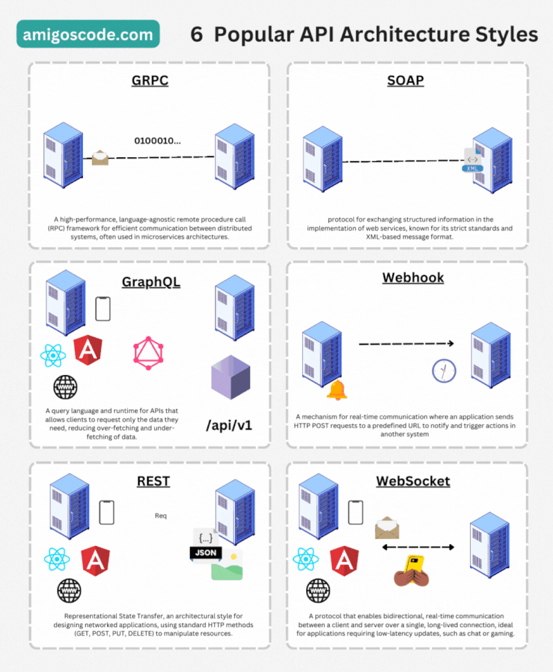

# 6 Popular API Architecture Styles

APIs are the backbone of modern software development. Here are six popular API architecture styles demystified:

## 1. gRPC

gRPC: 🚀 High-performance RPC framework for smooth communication in distributed systems. Ideal for microservices.

## 2. SOAP

SOAP: 🧼 Protocol for structured info exchange in web services. Known for strict standards and XML format.

## 3. GraphQL

GraphQL: 📜 Query language for APIs, allowing clients to request only needed data. Bye-bye over-fetching and under-fetching!

## 4. Webhook

Webhook: 🎣 Real-time communication mechanism. Apps send HTTP POST requests to trigger actions in other systems.

## 5. REST

REST: 🌐 Architectural style for networked apps. Uses standard HTTP methods (GET, POST, PUT, DELETE) to manipulate resources.

## 6. WebSocket

WebSocket: 🌐 Protocol enabling bidirectional, real-time client-server communication. Perfect for low-latency apps like chat and gaming.

🤔 Which one's your go-to right now?

Explore these API styles to level up your software game! 🚀