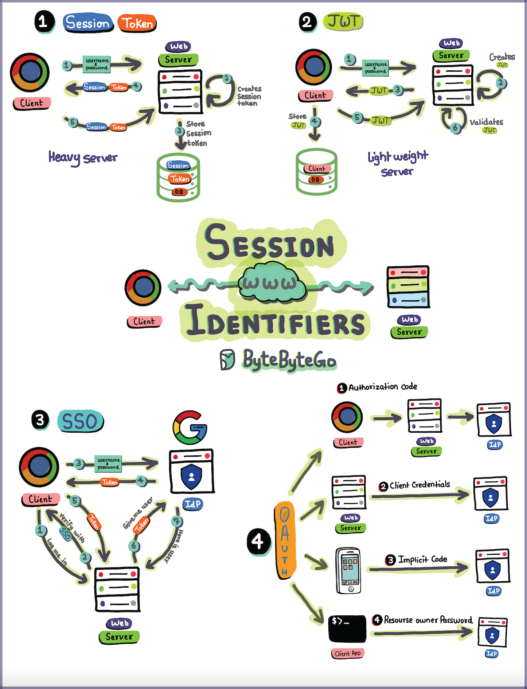

# Introduction

In the realm of web development and cybersecurity, session identifiers play a crucial role in ensuring secure and seamless user interactions.
Session identifiers, often referred to as session tokens, are essential components of authentication and authorization mechanisms.
In this article, we'll delve into four popular types of session identifiers: Session Tokens, JSON Web Tokens (JWT), Single Sign-On (SSO), and OAuth.

## 1. Session Tokens

Session tokens are a traditional and reliable method for managing user sessions on the server side.
When a user logs in, the server generates a unique session token and associates it with the user's session.
This token is then stored on the server, typically in a database, along with relevant user information and session details.

One of the advantages of session tokens is that they provide the server with full control over the user session.
However, this approach can be considered heavy in terms of server resources and maintenance,
especially when dealing with a large number of concurrent users.

## 2 JSON Web Tokens (JWT)

JWT has gained popularity as a lightweight alternative to traditional session tokens.
It is a compact, URL-safe means of representing claims between two parties.
In the context of user sessions, JWTs are often used to encode user information and authentication details.
Unlike traditional session tokens, JWTs are stateless, meaning all the necessary information is contained within the token itself.

JWTs are signed and can be encrypted for added security.
Their lightweight nature makes them suitable for microservices architectures and scenarios where server resources need to be optimized.

## 3. Single Sign-On (SSO)

Single Sign-On is a session management approach that allows a user to access multiple applications with a single set of login credentials.
SSO systems typically use a centralized authentication server that authenticates the user and issues tokens to be used across different applications.

SSO enhances user experience by reducing the need for multiple logins.
However, it also introduces potential security concerns, as a compromised SSO token could grant unauthorized access to multiple systems.

## 4. OAuth

OAuth (Open Authorization) is a widely adopted protocol for authorization, often used in conjunction with SSO.
OAuth enables third-party applications to access a user's resources without exposing their credentials.
It uses access tokens to grant limited access to a user's data on one platform to another application.

OAuth is commonly used in scenarios where users want to grant specific permissions to third-party services,
such as allowing a social media platform to access their photos without revealing the login credentials.

# Conclusion

In summary, session identifiers are fundamental in securing and managing user sessions in web applications.
Whether opting for traditional session tokens, embracing the lightweight nature of JWTs,
implementing Single Sign-On, or leveraging OAuth for third-party authorization,
each method comes with its unique strengths and considerations.

As technology evolves, developers must choose the session identifier approach that aligns with their application's requirements,
balancing factors like security, performance, and user experience.

Ready to elevate your understanding of session management and enhance your web application's security?
Dive deeper into the world of session identifiers, choose the right strategy for your project,
and stay ahead in the ever-evolving landscape of web development. Empower your users with seamless,
secure experiences—start implementing these session management techniques today!
