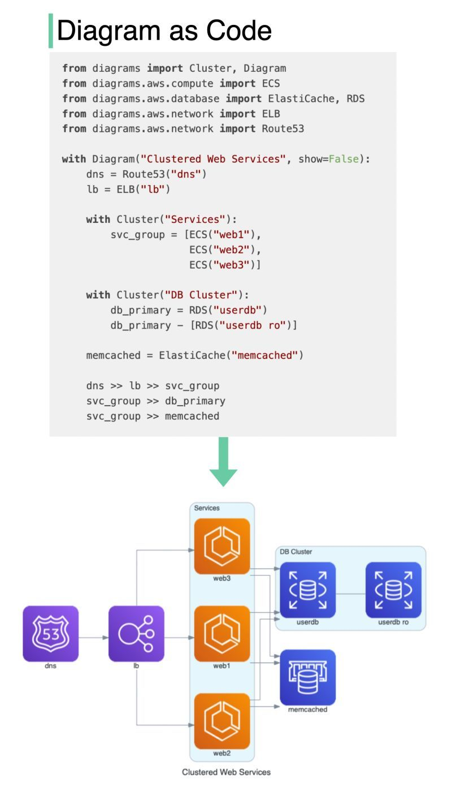

# Unlocking the Power of Code: Automatically Transform Your Architecture

In the ever-evolving landscape of technology, innovation is the key to staying ahead of the curve. Imagine if you could seamlessly translate your code into intricate architecture diagrams with minimal effort. Well, brace yourself for some exciting news! We've uncovered a remarkable GitHub repository that does exactly that – introducing "Diagram as Code" for effortlessly prototyping cloud system architectures.

## 🤯 What Does It Do?

### Create Cloud System Architecture Diagrams Using Python Code

Traditionally, designing complex cloud system architectures required mastering intricate design tools and meticulous manual labor. With "Diagram as Code," you can harness the power of Python code to craft intricate architecture diagrams effortlessly. Say goodbye to the days of wrestling with clunky software and complex interfaces.

### Render Diagrams Directly Inside Jupyter Notebooks

The integration with Jupyter Notebooks takes your architectural prototyping experience to the next level. Seamlessly render your diagrams right inside your notebook, enhancing collaboration and making it easier to communicate your vision with your team.

### No Need for Complex Design Tools

Forget about navigating convoluted design software. "Diagram as Code" simplifies the process, making it accessible to both seasoned professionals and newcomers in the field. You'll be amazed at how straightforward and efficient it becomes to bring your architecture to life.

### Supports Various Providers

Whether you're working with AWS, Azure, GCP, Kubernetes, Alibaba Cloud, Oracle Cloud, or a combination of these, "Diagram as Code" has you covered. Its versatility ensures that your cloud system architecture is accurately represented, regardless of your choice of cloud providers.

## Ready to Transform Your Architectural Design Process?

Are you ready to revolutionize your architecture design process? "Diagram as Code" is here to empower you, providing the tools you need to streamline your cloud system prototyping. Don't miss out on this game-changing repository!

[Check out the "Diagram as Code" GitHub repository here](https://github.com/mingrammer/diagrams)

By leveraging the power of code, you can unlock new dimensions of efficiency and creativity in your architectural endeavors. Say goodbye to the arduous and time-consuming process of manually creating architecture diagrams. Embrace the future with "Diagram as Code" and transform your code into architectural masterpieces effortlessly.

💡 Ready to simplify your architecture design process? Check out this repository and take your cloud system prototyping to the next level. 💡

Innovation awaits. Embrace the future of architectural design with "Diagram as Code." 🏗️🚀

Note: Make sure to visit the GitHub repository for detailed instructions and examples on how to get started with "Diagram as Code." Your architectural transformation journey begins there!
